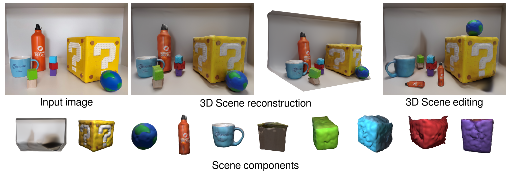

# Gen3DSR: Generalizable 3D Scene Reconstruction via Divide and Conquer from a Single View

This repository contains the official implementation of the paper titled *Generalizable 3D Scene Reconstruction via Divide and Conquer from a Single View*.

[](https://andreeadogaru.github.io/Gen3DSR/)
[](https://arxiv.org/pdf/2404.03421)

[Andreea Dogaru](https://andreeadogaru.github.io/),
[Mert Özer](),
[Bernhard Egger](https://eggerbernhard.ch/)



## 📢 News

15.07.2024: Inference code is released. <br>
04.04.2024: Paper is available on <a href="https://arxiv.org/pdf/2404.03421"></a>. 


## 🎮 Usage
- Interactive scene reconstruction examples can be found on our [project page](https://andreeadogaru.github.io/Gen3DSR/). 
- A Dockerfile is provided for easy setup:
```bash
docker build --build-arg HF_TOKEN=<USER_TOKEN> -t gen3dsr .
docker run -it --gpus all \
    --mount type=bind,source="$(pwd)/src",target=/app/src \
    --mount type=bind,source="$(pwd)/imgs",target=/app/imgs \
    --mount type=bind,source="$(pwd)/out",target=/app/out \
    gen3dsr python run.py --config ./configs/image.yaml
```
- Alternatively, after following the detailed local installation instructions presented in [INSTALL.md](INSTALL.md), the code can be run as follows:
```bash
cd src
python run.py --config ./configs/image.yaml \
    scene.attributes.img_path='../imgs/demo_1.jpg' \
    scene.save_dir='../out/demo_1'
```
- We recommend the user to check out the different inference options in [image.yaml](src/configs/image.yaml). 
- The reconstruction can be found in `<scene.save_dir>/reconstruction`.
- The code requires minimum 20GB of VRAM.

## 🎓 Citation
```
@article{Dogaru2024Gen3DSR,
    title={Generalizable 3D Scene Reconstruction via Divide and Conquer from a Single View},
    author={Dogaru, Andreea and Özer, Mert and Egger, Bernhard},
    journal={arXiv:2404.03421},
    year={2024}
}
```

## 🙌 Acknowledgements

This work is built on many amazing research works and open-source projects, thanks a lot to all the authors for sharing!

- [DreamGaussian: Generative Gaussian Splatting for Efficient 3D Content Creation](https://github.com/dreamgaussian/dreamgaussian)
- [High Quality Entity Segmentation](https://github.com/qqlu/Entity/blob/main/Entityv2)
- [Perspective Fields for Single Image Camera Calibration](https://github.com/jinlinyi/PerspectiveFields)
- [Marigold: Repurposing Diffusion-Based Image Generators for Monocular Depth Estimation](https://github.com/prs-eth/Marigold)
- [Depth Anything: Unleashing the Power of Large-Scale Unlabeled Data](https://github.com/LiheYoung/Depth-Anything)
- [Metric3D: Towards Zero-shot Metric 3D Prediction from A Single Image](https://github.com/YvanYin/Metric3D)
- [OneFormer: One Transformer to Rule Universal Image Segmentation](https://github.com/SHI-Labs/OneFormer)
- [One-2-3-45: Any Single Image to 3D Mesh in 45 Seconds without Per-Shape Optimization](https://github.com/One-2-3-45/One-2-3-45)
- [Open-Vocabulary SAM: Segment and Recognize Twenty-thousand Classes Interactively](https://github.com/HarborYuan/ovsam)

This work was funded by the German Federal Ministry of Education and Research (BMBF), FKZ: 01IS22082 (IRRW). The authors are responsible for the content of this publication. The authors gratefully acknowledge the scientific support and HPC resources provided by the Erlangen National High Performance Computing Center (NHR@FAU) of the Friedrich-Alexander-Universität Erlangen-Nürnberg (FAU) under the NHR project b112dc IRRW. NHR funding is provided by federal and Bavarian state authorities. NHR@FAU hardware is partially funded by the German Research Foundation (DFG) – 440719683.

## 📝 License

The code is released under the CC BY 4.0 [LICENSE](LICENSE).

